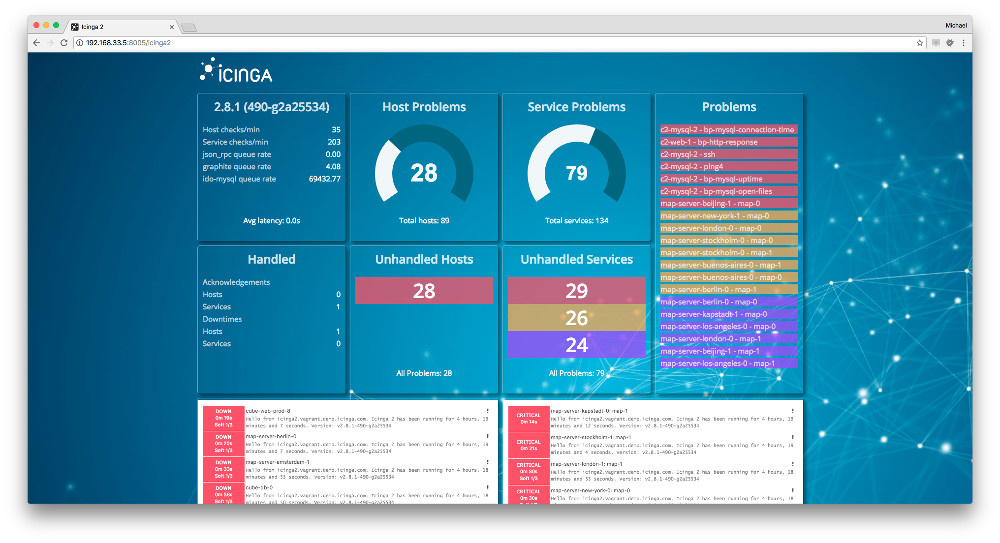

# General

[Dashing](http://shopify.github.io/dashing/) is a Sinatra based framework
that lets you build beautiful dashboards.

This dashing implementation uses the Icinga 2 API
to show basic alerts on your dashboard.

**This is intended for demo purposes and not for production usage.**
You may use the provided examples in your own implementation.

# Support

Please open issues at [dev.icinga.org](https://dev.icinga.org/projects/icinga-tools). In case
you've created a PR/patch, open a new issue linking to it as well please :)

If you have any questions, please hop onto the [Icinga community channels](https://www.icinga.org/community/get-help/).

# License

* Dashing is licensed under the [MIT license](https://github.com/Shopify/dashing/blob/master/MIT-LICENSE).
* Icinga specific jobs and dashboards are licensed under the GPLv2+ license.

# Requirements

* Ruby, Gems and Bundler
* Dashing Gem
* Icinga 2 API (v2.4+)

Gems:

    gem install bundler
    gem install dashing

In case the installation takes quite long and you do not need any documentation,
add the `--no-rdoc --no-ri` flags.

## Icinga 2

Icinga 2 provides either basic auth or client certificates for authentication.

Therefore add a new ApiUser object to your Icinga 2 configuration:

    vim /etc/icinga2/conf.d/api-users.conf

    object ApiUser "dashing" {
      password = "icinga"
      client_cn = "icinga2a"
      permissions = [ "*" ]
    }

In case you want to use client certificates, set the `client_cn` from your connecting
host and put the client certificate files (private and public key, ca.crt) in the `pki`
directory.

> **Note**
>
> The job script will attempt to use client certificates once found in the `pki/` directory
> instead of basic auth.

## Dashing Configuration

Edit `jobs/icinga2.erb` and adjust the settings for the Icinga 2 API credentials.

# Run

## Linux

Install all required ruby gems into the local `binpaths` directory. This will
prevent errors such as `ruby bundler: command not found: thin`.

    bundle install --path binpaths

Now start dashing:

    ./restart-dashing

Additional options are available through `./restart-dashing -h`.

Navigate to [http://localhost:3030](http://localhost:3030)

## Unix and OSX

On OSX El Capitan [OpenSSL was deprecated](https://github.com/eventmachine/eventmachine/issues/602),
therefore you'll need to fix the eventmachine gem:

    brew install openssl
    bundle config build.eventmachine --with-cppflags=-I/usr/local/opt/openssl/include
    bundle install --path binpaths

Note: Dashing is running as thin server which by default uses epoll from within the eventmachine library.
This is not available on unix-based systems, you can safely ignore this warning:

   warning: epoll is not supported on this platform

Now start dashing:

    ./restart-dashing

Additional options are available through `./restart-dashing -h`.

Navigate to [http://localhost:3030](http://localhost:3030)

## Additional Runtime Options

* Daemonize with `-d`. This will write the pid file underneath `tmp/pids/thin.pid`. Path can be specified using `--pid`.
* Listen on a different port using `-p <port>`.

# Thanks

[roidelapliue](https://github.com/roidelapluie/dashing-scripts) for the Icinga 1.x dashing script.

# TODO

* Add ticket system demo (e.g. dev.icinga.org)
* Add Grafana dashboard
* Slightly overhaul the dashboards
* Fix config.ru settings - [#227](https://github.com/Shopify/dashing/issues/227)
* Hints for Docker integration (docker-icinga2)

# Developer Hints

## Dashing Installation

    sudo gem install dashing
    sudo gem install bundler

    dashing new icinga2
    cd icinga2
    bundle

    dashing start

## Widgets

    dashing generate widget table
    dashing generate widget showmon

## Jobs

    dashing generate job icinga2

